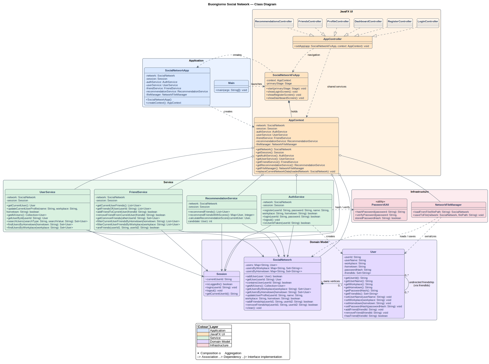

# Buongiorno Class Diagram

The diagram below reflects the Java implementation under `src/java`. It is
organised into five layers so that the main responsibilities and dependencies
remain readable when the diagram is inserted into a report.

## Architectural summary

- **Application** starts JavaFX and constructs the shared model, services, and
  persistence objects.
- **JavaFX UI** manages screen navigation. All six FXML controllers implement
  `AppController` and receive the same `AppContext`.
- **Service** contains authentication, profile, friendship, search, and
  recommendation logic.
- **Domain Model** represents the social network as an adjacency-list graph:
  `SocialNetwork` owns the users, while each `User` stores a set of friend IDs.
- **Infrastructure** loads and saves the network and securely hashes and verifies
  passwords.

## UML relationship legend

| Notation | Meaning |
| --- | --- |
| `*--` | Composition / ownership |
| `o--` | Shared aggregation |
| `-->` | Structural association |
| `..>` | Dependency / temporary use |
| `..|>` | Interface implementation |

Editable source: [`class-diagram.puml`](class-diagram.puml)  
High-resolution fallback: [`class-diagram.png`](class-diagram.png)
