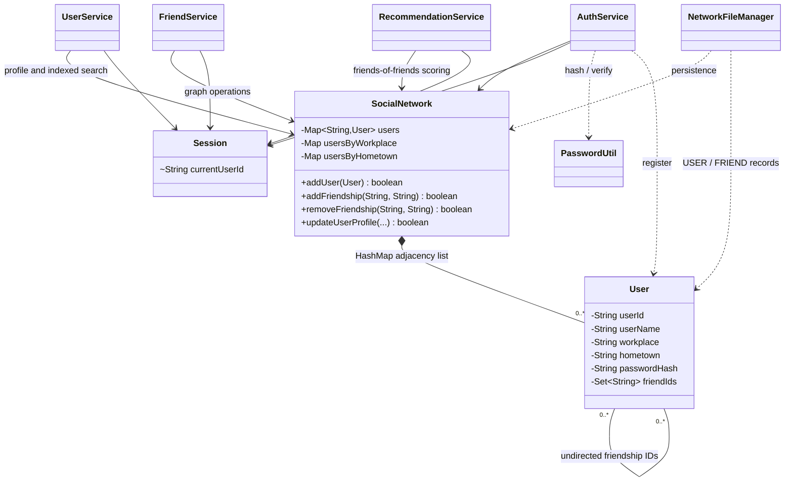

# Buongiorno Class Diagram

This document reflects the classes and dependencies currently implemented under
`src/java`. The first diagram shows the complete layered architecture; the second
focuses on the social-network graph and business logic.

## 1. Complete application architecture

```mermaid
classDiagram
direction LR

namespace Application {
    class Main {
        +main(String[] args)$ void
    }

    class SocialNetworkApp {
        -SocialNetwork network
        -Session session
        -AuthService authService
        -UserService userService
        -FriendService friendService
        -RecommendationService recommendationService
        -NetworkFileManager fileManager
        +SocialNetworkApp()
        +createContext() FxAppContext
    }

    class LegacyAppContext["app.AppContext"] {
        <<currently unused>>
        -SocialNetwork network
        -Session session
        -AuthService authService
    }
}

namespace JavaFX_UI {
    class SocialNetworkFxApp {
        -FxAppContext context
        -Stage primaryStage
        +start(Stage primaryStage) void
        +showLoginScreen() void
        +showRegisterScreen() void
        +showDashboardScreen() void
    }

    class FxAppContext["ui.javafx.AppContext"] {
        -SocialNetwork network
        -Session session
        -AuthService authService
        -UserService userService
        -FriendService friendService
        -RecommendationService recommendationService
        -NetworkFileManager fileManager
        +replaceCurrentNetworkData(SocialNetwork loaded) void
    }

    class AppController {
        <<interface>>
        +setApp(SocialNetworkFxApp app, FxAppContext context) void
    }

    class LoginController
    class RegisterController
    class DashboardController
    class ProfileController
    class FriendsController
    class RecommendationsController

    class RecommendationRow {
        -User user
        -int score
        +getUser() User
        +getScore() int
    }
}

namespace Service {
    class AuthService {
        -SocialNetwork network
        -Session session
        +register(String userId, String password, String name, String workplace, String hometown) boolean
        +login(String userId, String password) boolean
        +logout() void
        +isUserIdTaken(String userId) boolean
    }

    class UserService {
        -SocialNetwork network
        -Session session
        +getCurrentUser() User
        +updateCurrentUserProfile(String name, String workplace, String hometown) boolean
        +getAllUsers() Collection~User~
        +searchUsers(String type, String value) Set~User~
    }

    class FriendService {
        -SocialNetwork network
        -Session session
        +getCurrentUserFriends() List~User~
        +getFriendsOfUser(String userId) List~User~
        +addFriendToCurrentUser(String friendId) boolean
        +getCommonFriends(String otherUserId) Set~User~
        +areFriends(String userId1, String userId2) boolean
    }

    class RecommendationService {
        -SocialNetwork network
        -Session session
        +recommendFriends() List~User~
        +recommendFriendsWithScores() Map~User,Integer~
        -calculateRecommendationScore(User current, User candidate) int
    }
}

namespace Domain_Model {
    class SocialNetwork {
        -Map~String,User~ users
        -Map usersByWorkplace
        -Map usersByHometown
        +addUser(User user) boolean
        +getUser(String userId) User
        +getAllUsers() Collection~User~
        +updateUserProfile(...) boolean
        +addFriendship(String userId1, String userId2) boolean
        +removeFriendship(String userId1, String userId2) boolean
        +getUsersByWorkplace(String workplace) Set~User~
        +getUsersByHometown(String hometown) Set~User~
    }

    class User {
        -String userId
        -String userName
        -String workplace
        -String hometown
        -String passwordHash
        -Set~String~ friendIds
        +addFriend(String friendId) void
        +removeFriend(String friendId) void
        +hasFriend(String friendId) boolean
    }

    class Session {
        ~String currentUserId
        +isLoggedIn() boolean
        +login(String userId) void
        +logout() void
        +getCurrentUserId() String
    }
}

namespace Infrastructure {
    class NetworkFileManager {
        +loadFromFile(String filePath) SocialNetwork
        +saveToFile(SocialNetwork network, String filePath) void
    }

    class PasswordUtil {
        <<utility>>
        +hashPassword(String password)$ String
        +verifyPassword(String password, String hash)$ boolean
    }
}

Main ..> SocialNetworkFxApp : launches
SocialNetworkFxApp ..> SocialNetworkApp : creates
SocialNetworkFxApp *-- FxAppContext : holds
SocialNetworkApp *-- SocialNetwork
SocialNetworkApp *-- Session
SocialNetworkApp *-- AuthService
SocialNetworkApp *-- UserService
SocialNetworkApp *-- FriendService
SocialNetworkApp *-- RecommendationService
SocialNetworkApp *-- NetworkFileManager
SocialNetworkApp ..> FxAppContext : builds

LoginController ..|> AppController
RegisterController ..|> AppController
DashboardController ..|> AppController
ProfileController ..|> AppController
FriendsController ..|> AppController
RecommendationsController ..|> AppController
AppController ..> SocialNetworkFxApp
AppController ..> FxAppContext
RecommendationsController *-- RecommendationRow
RecommendationRow --> User

FxAppContext o-- SocialNetwork
FxAppContext o-- Session
FxAppContext o-- AuthService
FxAppContext o-- UserService
FxAppContext o-- FriendService
FxAppContext o-- RecommendationService
FxAppContext o-- NetworkFileManager

AuthService --> SocialNetwork
AuthService --> Session
AuthService ..> User : creates
AuthService ..> PasswordUtil
UserService --> SocialNetwork
UserService --> Session
UserService ..> User
FriendService --> SocialNetwork
FriendService --> Session
FriendService ..> User
RecommendationService --> SocialNetwork
RecommendationService --> Session
RecommendationService ..> User

SocialNetwork *-- "0..*" User : owns
User "0..*" -- "0..*" User : friendship via friendIds
NetworkFileManager ..> SocialNetwork : loads / saves
NetworkFileManager ..> User : serializes
```

## 2. Core graph and business-logic view

## Architectural reading

- `Main` launches JavaFX; `SocialNetworkFxApp` controls screen navigation.
- `SocialNetworkApp` is the composition root that creates the model, services,
  and persistence objects.
- `ui.javafx.AppContext` shares those objects with every FXML controller.
- Controllers contain presentation and interaction logic and delegate business
  operations to the service layer.
- `SocialNetwork` is the graph owner: users are vertices and the `friendIds`
  sets represent undirected edges using an adjacency-list design.
- `SocialNetwork` also maintains workplace and hometown indexes for efficient
  lookup.
- `NetworkFileManager` is the persistence boundary, while `PasswordUtil` is a
  stateless authentication helper.
- `app.AppContext` is present in the source tree but is not referenced by the
  current application flow; the runtime uses `ui.javafx.AppContext`.

## UML relationship legend

- `*--` composition / ownership
- `o--` shared aggregation
- `-->` structural association
- `..>` dependency / temporary use
- `..|>` interface implementation
